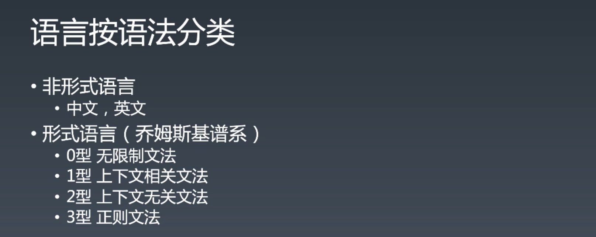
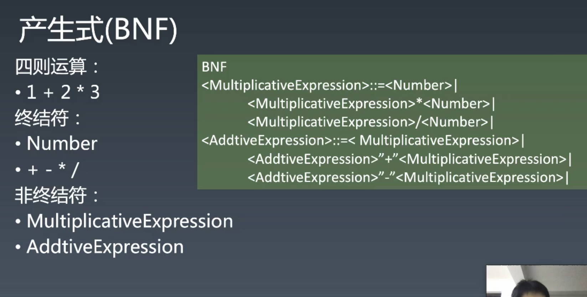
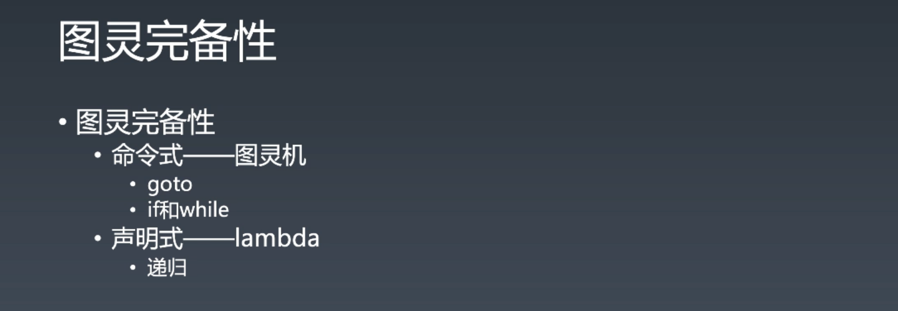
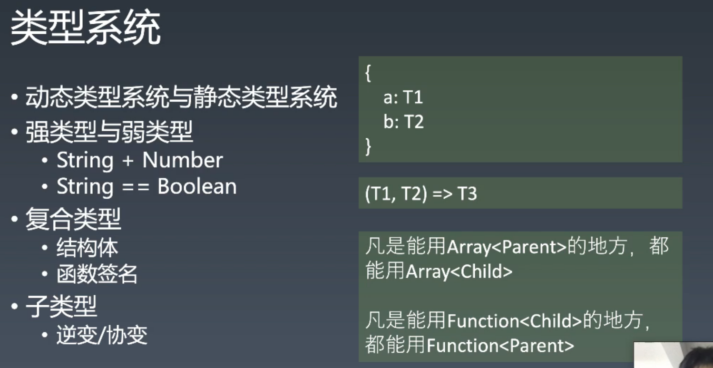

# 01 | 重学 JavaScript | 编程语言通识与JavaScript语言设计

[TOC]

这门课程与极客时间上**重学前端**重合度很高，也就是说可以看**重学前端**来进行预习。

## 编程语言通识



- 人类语言是非形式语言且非严格的，和计算机交流是形式语言且严格的。

### 什么是形式语言（乔姆斯基谱系）

> - 50 年代是计算机时代的黄金期
>
> - 乔姆斯基谱系已经过了 50 年了，但乔姆斯基谱系依然是可以帮助我们定义语言的谱系

#### 0型 无限制文法

#### 1型 上下文相关文法

#### 2型 上下文无法文法

#### 3型 正则文法

概括：能用正则表达式表示的文法。对表达能力的限制非常强。


要理解形式语言需要了解：产生式（BNF）


> 英文中的符号都叫：symbol

- 引号为终结符
- 尖括号为非终结符

```
一种能用 a 和 b 两种字符组成
终结符 "a"
终结符 "b"

非终结符：<Program>
<Program>: = "a"+ | "b"+
这个语言可以递归：
<Program>: = <Program> "a"+ | <Program> "b"+

定义加法，并且可以连加，整数加法：

定义number
<Number> = "0" | "1" | "2" | ... | "9"

<DecimalNumber> = "0" | (("1" | "2" | ... | "9")+ <Number>+) 123812738912 但 01 不合法

<AddtiveExpression> = <DecimalNumber> "+" <DecimalNumber>

<AddtiveExpression> = <ExPression> "+" <DecimalNumber>

<AddtiveExpression> = <DecimalNumber> | <AddtiveExpression> "+" <DecimalNumber>
```



定义一个四则运算：

```
接上面：
<MultiplicativeExpression> = <DecimalNumber> | <MultiplicativeExpression> "*" <DecimalNumber>

1 + 2 * 3 也就是 AddtiveExpression 和一个 MultiplicativeExpression

<LogicalExpression> = <AddtiveExpression> | 
	<LogicalExpression> "||" <LogicalExpression>
```

> ```
> winter:
> 
> <Number> = "0" | "1" | "2" | ..... | "9"
> 
> <DecimalNumber> = "0" | (("1" | "2" | ..... | "9") <Number>* )
> 
> <PrimaryExpression> = <DecimalNumber> |
>     "(" <LogicalExpression> ")"
> 
> <MultiplicativeExpression> = <PrimaryExpression> | 
>     <MultiplicativeExpression> "*" <PrimaryExpression>| 
>     <MultiplicativeExpression> "/" <PrimaryExpression>
> 
> <AdditiveExpression> = <MultiplicativeExpression> | 
>     <AdditiveExpression> "+" <MultiplicativeExpression>| 
>     <AdditiveExpression> "-" <MultiplicativeExpression>
> 
> <LogicalExpression> = <AdditiveExpression> | 
>     <LogicalExpression> "||" <AdditiveExpression> | 
>     <LogicalExpression> "&&" <AdditiveExpression>
> ```


无限制文法：

```
<a> <b> ::= "c" <d>
```

上下文相关文法：

```
"a" <b> "c" ::= "a" "x" "c"
也就是说在 "a" 和 "c" 的中间才会被理解为文法，此时的上下文 "a" 和 "c" 不会动
```

上下文无法文法：

```

```

正则文法：


思考题：能不能将上面的产生式用正则来解析，比如：

```
<Number> = "0" | "1" | "2" | ... | "9"
<DecimalNumber> = "0" | (("1" | "2" | ... | "9")+ <Number>+) 
<DecimalNumber> = /0|[1-9][0-9]*/
```


```
{
	get a {return 1}
	get: 1
}
```

上面的 get 是几型文法，1 型，因为后面是 函数 和 `:` 不同

```
2 ** 1 ** 2
```

上面的 `**` 是 2 型

> 正则并不高效，JS 更不高效，因此正则不会用来处理大型字符串，不会用它产生递归和回溯


我们接触的大多数计算机语言，比如 JS，都是以 2 型为主，偶尔给你来个惊喜会来个 1 型，比如 a.class 与 class


JS 并不是由 BNF 定义，但是很像


JS中产生式的自定义写法：

- 词法定义：双冒号
- 语法定义：单冒号
- 终结符是以加粗的方式


通过实例学习 JS 比较适合入门，但是会漏掉完备性。


C++ 编译器非常复杂





自己写代码叫编程，元编程就是写一个程序帮你写代码。


编程语言决定了开发者的开发体验。





课后问答

```JS
2 ** 2 => 4
2 ** 2 ** 3 => 256 (2 ** (2 ** 3)) 右结合
```


可以看到 `**` 其自身在右侧，也由此 JS 变成了二型文法


> 下节课开始可以用重学前端中的内容去预习了


- 写的越舒服，约束就越弱，就不太适合大型项目，因为容易出 bug


- 对内存极致的追求都会使用到 buffer

