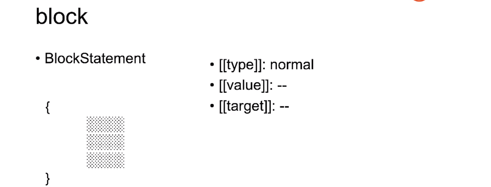

# 02.重学 JavaScript | 语句，对象

[toc]

## Statement 语句

- 在 JS 中我们怎么去定义、理解语句。


首先我们来讲语句分个类，在 Grammar 层面有三种分类：

- 简单语句
  - 只有一句，比如 call 一个什么，
- 组合语句
  - 可以嵌套简单语句
- 声明
  - 会产生特殊行为


### Runtime

出了我们之前所说的八种从语法层面来说的数据类型之外，在 Runtime 中还有很多内置类型，虽然这些类型我们在写代码时碰不到，但当程序运行时它们却确实存在于内存之中。

两个概念：

- Completion Record
  - 早期版本就叫 Completion，指语句的执行结果
- Lexical Enviorment
  - 初始词法环境


#### Completion Record


这个类型有三个字段：

- [[type]]；语句完成的类型，有五种取值，对应四个语句。
- [[value]]；之前所讲的八种语言类型。不过有空值 `empty` 
  - 目前，只有 `throw` 和 `return` 会带这个字段
- [[target]]；一定是个 label

这些都是指**语句完成后**状态的描述。虽然 Completion Record 如果不去读规范，可能都不知道有这么个东西，但是它却是在影响着语句的行为。之后也会在不同的语句中讲解它是如何发挥作用的。（以下简称 CR）


### 简单语句


其中三个产生 normal，四个产生非 normal。

复杂语句中都是根据其产生的 type 来决定自己的执行过程。 

#### ExpressionStatement（表达式语句）

表达式本身就可以构成一个语句，也是语句中最主体的部分，其告诉计算机做运算。

```js
a = 1 + 2;
```


#### EmptyStatement（空语句）

也就是一个分号 `;`

```js
;
```


#### DebuggerStatement（调试语句）

`debugger` 这个语句对于运行时而言不会发生任何作用，比如用户的电脑上，但是其在控制台中用于调试，产生中断，是规范留给引擎去实现的一个东西。

```js
debugger
```


#### ThrowStatement

其后面可以跟一个表达式

```JS
throw a;
```


#### ContinueStatement

```js
continue;
// or
continue [label1];
```

- 可带 `label`

#### BreakStatement

```js
break;
// or
break [label2];
```

- 可带 `label`

#### ReturnStatement

其后面可以跟一个表达式

```js
return 1 + 2;
```


### 复合语句


#### BlockStatement



- 其由一对 `{}` 括起来构成，和对象的直接量构成方式相同。

- 会将多条语句括起来之后变成像是一条语句。所以它是形成我们语句非常关键的一个因素。

- 在最新的 ECMA 中，还能为 `let` 和 `const` 提供作用域。所以你可以在控制台中这样写代码：

  ```JS
  {
    const a = 1;
  }
  
  {
    const a = 1;
  }
  ```

- 正常情况下 BlockStatement 的执行结果就是 normal，不过如果其内部 statement list 中的语句产生了非 normal 的结果则执行过程会被中断，比如：

  ```js
  {
    const a = 1;
    throw 1;
    const b = 2;
    console.log(b)
  }
  ```

  - 这里因为 `throw 1` 语句而中断了 block 语句的中的执行过程。
  - 这也是 `throw` `continue` `break` `return` 能够改变代码、语句执行顺序的基础逻辑，都在 block 中。

- blockstament 虽然很简单，也就是语句的顺次执行，但如果一旦其中某个语句产生了非 normal 的结果，从而能够产生代码结构化的特点（不是很懂，这个后面应该在讲代码结构化的部分会讲到）。

- 从这里我们可以看出，CR 的 type 是非常重要的东西，能够控制语句执行不执行，怎么执行。

#### Iteration


这里先讲前 5 种，`for await(of)` 等着之后讲结构化，promise 的部分再展开。

Iteration 语句和别的语句不同的是，语句可以执行多次，而其他的只会执行一次。

上面

- `while` 是由一个表达式 + 语句的结构，由于有 block 语句的存在，所以其可以有多个简单语句。`while` 有个特点，如果其内部语句的 CR type 是 `continue` 或者 `break`，`while` 会将其消费掉。而不是简单的跳出这个语句，也就是说如果子语句出现 `continue` 或者 `break` 就会做相应的处理。如果是 `break` 就不执行了，`continue` 则中断这一次的 block，跳过这一次循环。

  - 如果 `break` 和 `continue` 的 CR 带有 label，则会由 `lable` 所指定的目标语句来消费。目前，lable 只有在循环语句中有作用。

- `do...while` 和 `while` 基本相同，只是多执行一遍语句。

- `for` 很特殊，上图中的偏黑部分可以放声明（let const var），对于 `var` 的声明都还好，因为其产生的变量只会在函数中产生作用域，而 `let` `const` 就会产生作用域，其范围在 block 之外。

  ```js
  for(let i = 0; i < 10; i++){
    console.log(i);
  }
  // => 0 1 2 3 4 5 6 7 8 9
  
  for(let i = 0; i < 10; i ++){
     let i = 0
    console.log(i);
  }
  
  // => (10) 0 
  
  {
    let i = 0;
    if(i < 10){
      let i = 0
    	console.log(i);
    }
    i ++
  }
  ```

  - 在第二个 for 循环的语句中，我们重新声明了一个 `i` 但是并没有报错，说明并不是在 block 中声明的。
  - 可以试想是在 block 之外还有一个 block，在那里声明了一个 i 

  - `let i = 0; i < 10; i ++` 这三句话可以理解为在循环外层有一个副作用域，如上 13 行开始的代码。

- `for in` 和 `for of` 在语句结构层面完全类似
  -  `for in`  循环一个对象的所有属性
  - 而 `for of` 就稍微比较复杂，对任何可迭代属性的对象进行迭代，可以将其理解为一个语法糖，相当于调用了对象上的一个方法。

- `in` 运算符和 `for in` 中的 `in` 有语法冲突，所以 `for in` 中的表达式是不能出现 `in` 的，那么语法的规范中就出现了两种表达式，带 `in` 和不带 `in`
- 


## 课程涉及内容

### 课后作业：

- 找出 JavaScript 标准里有哪些对象是我们无法实现出来的，都有哪些特性？写一篇文章，放在学习总结里。

### 有助于你理解的知识：

- 按照 ECMAScript 标准，一些特定语句（statement) 必须以分号结尾。分号代表这段语句的终止。但是有时候为了方便，这些分号是有可以省略的。这种情况下解释器会自己判断语句该在哪里终止。这种行为被叫做 “自动插入分号”，简称 ASI (Automatic Semicolon Insertion) 。实际上分号并没有真的被插入，这只是个便于解释的形象说法。
- var 最好写在函数内最前面或变量第一次出现的地方

