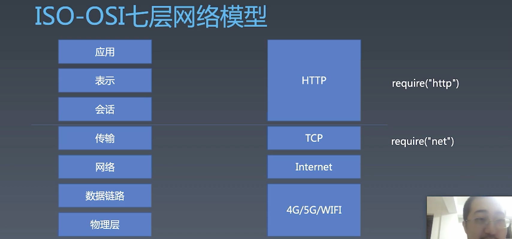
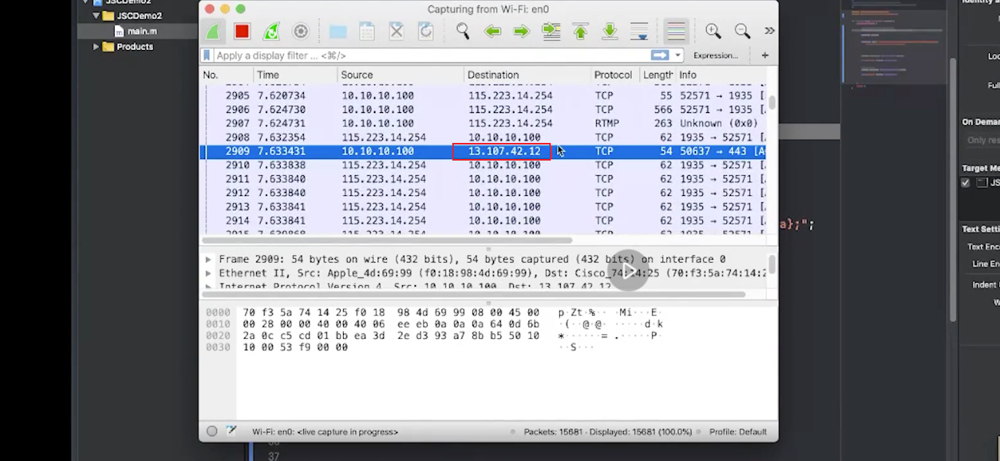

#  浏览器工作原理 | HTTP协议+语法与词法分析（一）

[toc]

## 浏览器工作原理——总论与 http 协议

前面我们所讲的是 JS，讲解的过程中尽量与语言本身贴的很近，没有去涉及语言之外的部分，比如浏览器部分。这节课开始我们讲从浏览器工作原理开始讲起，并带着大家做一个玩具浏览器——`toy-browser`

### 浏览器干了什么

当你在地址栏输入地址之后敲下回车到页面完全显示出来，这个过程中到底发生了什么？

这个问题特别好，甚至可以一直讲到数电模电，不过我们从浏览器的角度来说，大概要经历一下事情：

首先浏览器拿到 url，要发起 http 请求，回来的主体是一个 html 代码，这个 html 我们对它进行 parse，解析之后产生 dom 树，然后如果文件中有 css 则 parse css，形成 cssom，有了 cssom 和 dom 就可以进行 layout 排版，确定元素的位置，接着我们就有了有 position 的 dom 树，之后我们再进行 render 渲染，最终得到一个 bitmap（位于内存中的二进制图片）将其显示在屏幕上。（这部分可以去看 Uacity 的课程，或是 google 开发者社区上的课程）

大概就是以上的步骤（当然以上每一步都非常的复杂），我们的玩具浏览器会以框架最外层最简单的方式去实现。

### 网络常识

#### ISO-OSI 七层网络模型

如今网络没有这么复杂，左边的七层模型对应的就是右边的 4 层协议和实现，比如上面的三层都会混成一起为 `http` 。

浏览器是在 TCP 之上的 HTTP 基础上建立的。为什么要讲 IOS-OIS 七层，是因为如果你不知道这个层的关系，那么你就不知道 HTTP 要如何实现。所以，在 node 中，TCP 层我们需要的包就是 `net` ，在 HTTP 层则 `require("http")` 就可以。

我们做浏览器是为了熟悉其环境，所以我们不能引 `http` 模块，虽然是一个现成的东西，我们要 `require("net")`，在 TCP 协议的基础上去实现 http 的内容，虽然我们不会写得和 node 中的 http 模块一样健壮强大，但是可以在实现的过程中产生一些自己的理解。

同学提问：TLS/SSL 在哪一层？

- 理论上说也在传输层，因为传输层里面也可以继续细分，可以分为加密传输层和非加密传输层，甚至还可以再在 TLS 上再加协议。

#### TCP 与 IP 的一些基础知识

我们总是会将 TCP 与 IP 的一些知识点混淆，比如网上有关于 TCP 粘包问题，这就让很多人感到奇怪，因为

- TCP 是流式传输，而只有 IP 才有包的概念。
- 标示 TCP 的是端口，而 IP 则是使用 IP 地址。
- 在 node 中，我们访问 TCP 是使用 `net` 包，而 IP 访问不到，我们只能用 C++ 去访问。

在我们的电脑上面我们会收到很多 IP 的包，但是大部分 IP 包跟我们没有关系，比如在同一个局域网，你的局域网用的是集线器而不是路由器来组成，会发现大家互相发的 IP 包你都能看到。

我们可以使用 `wireshark` 抓包来看，可以抓一个网卡上的所有的包。可以看到你的机器随时都在收到各种包，不过并不是所有的包都在被你的机器随时的处理，因为有些包和你没有关系，但是能够收到。比如这个：

到 `13.107.42.12` 这个地址的包，根本不是发给我们的，但是我们能够收到。如果要调试 JS 我们可以使用 Charles 来抓 http 层的包。

TCP 层就假设 IP 能够让你们两台机器之间连通，所以它的传输是一个流式传输，而且是一个可靠流，收不到会重发。

TCP 端口的概念用于标示应用，因为网卡收到一堆网络的包之后，你是不知道要分配给哪个应用，否则你不知道哪个应用想要这个包，端口就是告诉网卡将包分配给哪个应用。所以大家一启动 node 应用就发现端口被占用，所以不同的应用需要注册不同的没有被占用的端口，一台机器的端口就这么多，你占了别的应用就不能用了。

当然 TCP 里面还有具体的流是如何传输的，什么 3 次握手，IP 得有个包头，包头里有什么，IP 自己的路有规则是什么。

#### HTTP

这部分就是我们下节课开始要实现的部分。

HTTP 是在 TCP 的基础上规定了一个 Request Response 模型，它是一问一答，而且是先问后答，这和 TCP 不同，TCP 全工通道，也就说服务端可以客户端发消息，客户端也可以给服务端发消息。在 TCP 协议层面只保证你的消息的顺序和到达的情况，没有办法帮你规定你发了消息之后服务端一定要回答你。但是 HTTP 不同，首先服务器端不能主动给你 Response 的，必须要在你发了 Request 的情况下，他才能回复。

所以，HTTP 这种形式看似是一个对 TCP 的一种限制，其实这种模式很好的满足了大部分应用的需要，最终 HTTP 变成了互联网上在整个 internet  中流转的绝大多数应用所选择的协议。

那么我们想要实现一个 http，就两个步骤，一实现 Request，二是实现 Response

抓包软件：

- charles
- Fiddler
- whistle