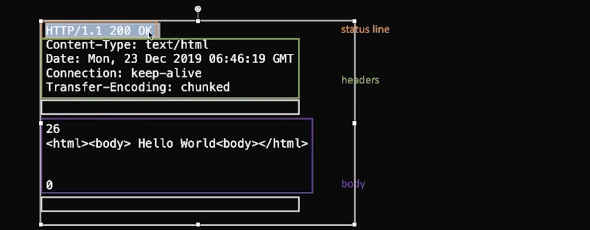
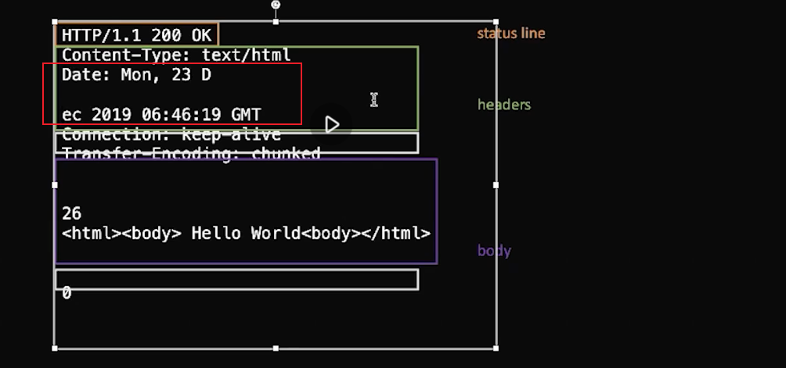

# 浏览器工作原理 | HTTP协议+语法与词法分析（二）

[toc]

## 实现玩具浏览器

在我们实现玩具浏览器之前，需要看一下 node 的 http 是如何实现的。


当我们使用 `http.request` 并带上如下参数时，服务器端就会回复消息。

```js
const options = {
  port: 1337,
  host: '127.0.0.1',
  method: 'CONNECT',
  path: 'www.google.com:80'
};

http.request(options);
```


创建服务器会使用 `http.createServer`，所以我们创建一个服务器用于被玩具浏览器访问：

```js
const http = require("http");

const server = http.createServer((req, res) => {
  console.log('createServer')
  res.setHeader('Content-Type', 'text/html');
  res.setHeader('X-Foo', 'bar');
  res.writeHead(200, { 'Content-Type': 'text/plain' });
  res.end('ok');
});

server.listen(8088);
```

- 当我们通过以上代码 node 这个文件创建好服务器之后，访问 `http://127.0.0.1:8088/` ，查看控制台 `Network` 可以看到 Header 信息：
  

- 这个 Header 信息是浏览器已经帮我们处理并结构化的内容。


### 实现 http client

```js
let xhr = new XMLHttpRequest;

xhr.open("get","http://127.0.0.1:8080", true);
xhr.send(null);

xhr.responseText // => "ok"
```

- `XMLHttpRequest` 的实例就是我们最熟悉的 http client 


要实现 http client 实现上我们只需要实现 `Request` 和 `Response` 两个类就可以了：

```js
class Request{
  
}

class Response{
  
}
```


在实现之前，我们需要了解实现 http 更低层的东西—— net

```js
const net = require('net')
```

- 用 node 则遵循 node 的规范使用 `require()` 来请求模块


#### net

net 是 TCP 协议的基础库

基本用法：

```js
const net = require('net');

net.connect({
  host: "127.0.0.1",
  port: 80,
  onread: {
    // Reuses a 4KiB Buffer for every read from the socket.
    buffer: Buffer.alloc(4 * 1024),
    callback: function(nread, buf) {
      // Received data is available in `buf` from 0 to `nread`.
      console.log(buf.toString('utf8', 0, nread));
    }
  }
});
```


#### http 标准

标准地址：https://tools.ietf.org/html/rfc2616，这是 1.1 的标准，一百多页，有时间和精力可以看一看。


先看一下精简版：


Request 由三部分组成：

- request line，又分为三部分
  - methods  —— POST
    - 常见 methods 有 GET POST PUT DELETE
    - 虽然可以随便定义，1.1 版本中定义有如下：
    - 
    - 最重要的是 OPTIONS GET POST，因为现代浏览器基本其他的不太使用。
  - path 路径 —— `/`
  - 协议 —— HTTP/1.1
- request headers —— 头
  - headers 之后有一个空行
- request body —— 主体
  - 有多种不同的格式，responds body 也有多种不同的格式。

上节课我们讲过 TCP 是一个流，而上面图中的信息就是流中的文本。


由于 TCP 链接有三次握手，所以我们需要在 net 中找一个事件`connect`，使用一个 node 的例子：

```js
const client = net.createConnection({ host: '127.0.0.1', port: 8088 }, () => {
  // 'connect' listener.
  console.log('connected to server!');
  client.write('world!\r\n'); // 我们的服务不认识这个字符，所以返回了 HTTP/1.1 400 Bad Request
});
client.on('data', (data) => {
  console.log(data.toString());
  client.end();
});
client.on('end', () => {
  console.log('disconnected from server');
});
```

- 当我们通过 `node client.js` 运行这个客户端后，连接成功，但是会返回 400，因为服务端不认识 `world!\r\m` 字符，所以我们需要更改请求文本

```js
const client = net.createConnection({ host: '127.0.0.1', port: 8088 }, () => {
  // 'connect' listener.
  console.log('connected to server!');
  // client.write('world!\r\n'); // 我们的服务不认识这个字符，所以返回了 HTTP/1.1 400 Bad Request
  client.write(`
  POST / HTTP/1.1\r
  Content-Type: application/x-www-form-urlencoded\r
  Content-Length: 11\r
  \r
  name=winter`); // 
 
});
client.on('data', (data) => {
  console.log(data.toString());
  client.end();
});
client.on('end', () => {
  console.log('disconnected from server');
});
```

- 通过向服务端发送一段 http 所规定格式的文本来进行请求
- 所以，我们要知道，http 是一个文本协议，并非一个二进制的有特殊字符在发送内容中的协议，其主要分隔符是 `\r\n`，我们之后在实现 `Request` 类时也会根据这个思路来实现。

### Request

在实现 Request 之前我们可以参考 MDN 上的 XHR（[XMLHttpRequest](https://developer.mozilla.org/en-US/docs/Web/API/XMLHttpRequest)）的 [open](https://developer.mozilla.org/en-US/docs/Web/API/XMLHttpRequest/open) 方法：

```js
XMLHttpRequest.open(method, url[, async[, user[, password]]])
```

- open 包含了 `method` 和 `url` 

那么对于我们来说，我们的 `Request` 需要：

-  `method` 和 `url` ，`url` = `host` + `port` + `path` 
- `headers` ，必有 `Content-Type` 和 `Content-Length`， 而 `Content-Type` 在这里使用最简单的用于表单提交的 `application/x-www-form-urlencoded`
  - 实际上 `Content-Type` 有很多种格式，比如当你要提交的表单中有文件的时候就需要使用 `multipart/form-data` 格式，提交 `XML` 时的 `text/xml` 和提交 `json` 的 `applicatioin/json` 
  - 所有的格式提交的 `body` 都是 `k/v` 对
- `body` ： `k/v` 结构

接下来我们就要开始设计 API 了。

比如我们可以在 constructor 时收集所有的配置可选项，这样便可以在之后的方法调用中直接从实例的属性中去取。

```js
class Request {
  // method, url = host + port + path
  // headers
  // body: k/v
  constructor(options){
    this.method = options.method || "GET";
    this.host = options.host;
    this.port = options.port || 80;
    this.path = options.path || '/';
    this.body = options.body || {};
    this.headers = options.headers || {};
    if(!this.headers["Content-Type"]){ // 这里就不做驼峰转 `-` 的转换了，不过这可以提高开发体验
      this.headers["Content-Type"] = 'application/x-www-form-urlencoded'
    }
    
    if(this.)
  }
}
```


### Response

格式：



- `status line` 状态行
  - 版本 ：`HTTP/1.1` 
  - 状态码：`200` 
  - 状态：`OK`
- `headers`
- `空行` 
- `body`
  - `body` 的 encode 比较复杂，node 的 `Transfer-Encoding` 一般会选用 `chunked` ，`chunked encoding` 的每一块是先由单独一行的整数来表示后面字符的数量（26），接着是这个数量的字符，然后又是单独一行的字符数量和字符，一直到 0 为止。
  - 那么对于 `chunked encoding` 我们就需要进行解析。
  - 解析需要使用到「状态机」而不能使用正则，因为每个 `data`（监听 data 事件返回的数据） 并不是如上面图示中那样完整的数据格式，很有可能会是断开的，比如：
    
  - 前一个 `data` 正好在 D 的位置结束，后一个 `data` 接着从 ec 开始。这样并不能确定文字的格式，不好使用正则。
  - 之所以会产生这种不确定大小的 `data`，是和 `data` 事件的触发条件有关的，一个触发条件是其 buffer 满了，客户端从网卡接受数据有可能会满，比如你分配了 10kb 的空间，当这 10kb 被写满就会触发一个 data 事件。还有一个触发条件是服务端收到了一个 IP 包，IP 这里就不讲这么细了，TCP 我们认为是一个流，断在哪里是无所谓的，这也是有些面试总会问到的沾包问题如何处理，服务端发给客户端指不定会发多少个包，而其只保证这些包在顺序上的正确定的，而不保证分包的状态，而你的客户端同时也有 buffer 存在，这个 buffer 有可能比包大，也有可能比包小，所以你无法假设这个事，data 则变成了一个流，因此我们将要把这个流一部分一部分的灌给 Parser，然后这个 parser 收集满了 response 我们就将其吐出一个 response。

#### 状态机

对于 response text 的状态分为如下几个：

- 第一个状态在 OK 处结束，也就是 `status line`
- 第二个状态在 chunked 结束，也就是 `headers`
  - `headers` 中也可能会存在其他的一些子状态
- 然后等待一个空行
- 进入 `body` 之后就需要另起一段解析的代码，因为其是 chunked encoding 相关的


下节课我们需要用到本节课解析拼接的 response body 


 


## 课程涉及

### 预习内容：

- [浏览器：一个浏览器是如何工作的？（阶段一）](https://time.geekbang.org/column/article/80240)
- [浏览器：一个浏览器是如何工作的？（阶段二）](https://time.geekbang.org/column/article/80260)

### 本节课你需要修改一下以下代码：

```js
this.length *= 16;
this.length += parseInt(char, 16);
```

### 课后作业：

- 观看本节课，根据老师课上讲解，完成课堂上的代码