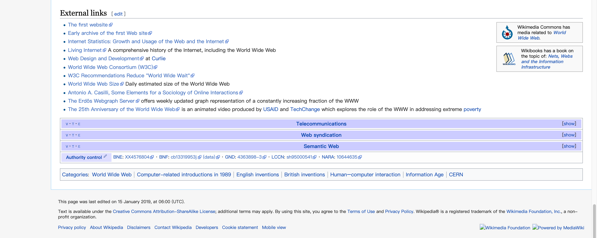
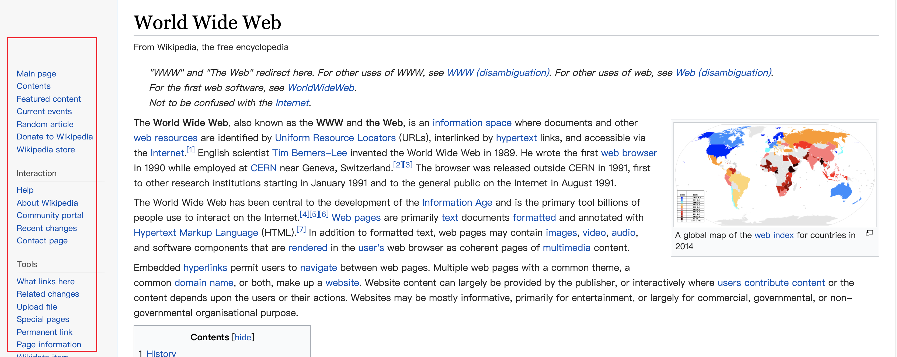

# 2.重学HTML | HTML语言与扩展

[toc]

上节课我们已经将 CSS 部分的内容讲完，但并不一定是非常完整的，只是按照了 winter 所认为的分类体系来逐一进行了讲解。实际上，你可以通过自己的思考和研究来完善 CSS 知识体系。

## 重学HTML 

### HTML 的定义：XML 与 SGML

HTML 是由 [**Tim Berners-Lee**](https://zh.wikipedia.org/wiki/%E8%92%82%E5%A7%86%C2%B7%E4%BC%AF%E7%BA%B3%E6%96%AF-%E6%9D%8E) 发明，同时它也创建了 W3C 和发明了 HTTP，我们的先辈，没有他发现的这些东西就没有我们的工作。

HTML 参考了 SGML，SGML 是 60 年代末 IBM 公司使用的标记语言，用于图书管理和文档描述，特点是可封闭也可以不封闭。

HTML 相当于在明确的 DTD 之下定义的一门标记语言，理论上在当时属于 SGML 的子集，但是并不是使用 SGML 引擎去解析，SGML 在那个年代并没有一个通用的处理引擎，所以 SGML 是定义了语言，你还是得针对这个语言去写自己的解析器。可以将 SGML 理解为学术概念而非能够直接使用的东西。

2000 年之后的某个时间，XML 作为 SGML 体系下的一个子集出现，有几个规定，开始和结束标签需要配对，另外使用了 XML space 去代替了 SGML 的 DTD。所以，早年 W3C 做过一件非常丢人的事情，他们搞了一个 HTML 2.0，这个版本最终是彻彻底底的失败了，因为当时 XML 很流行，所以 HTML 的组织就朝着这个 XML 反向发展，规定了很多严格遵循 XML 的 HTML 结构，包括我们的 p 标签现在是可以不写结束标签的，在2.0 是不行的。这些让开发者感觉麻烦的特性导致 W3C 中几个反对 2.0 的几个人离开了 W3C 并去创建了 WhatWG 这个组织，并开始发明 HTML5，后来又发生了很多事情，WhatWG 的人又被叫回的 W3C。

所以，如果我们想要整体上了解 HTML 这个语言是如何定义的，有两个视角—— XML 和 SGML：

- XML：http://www.w3.org/1999/xhtml
- SGML：https://www.w3.org/TR/xhtml1/DTD/xhtml1-strict.dtd


#### DTD（[Document type definition](https://en.wikipedia.org/wiki/Document_type_definition)）

DTD 会以实体（ENTITY，@符开始的东西）的方式去定义。

- 会引入其他的文件

- 会定义通用的事件

- 会定义元素

- DTD 不推荐大家去认真看，只要知道即可。但是推荐大家去看 `.ent` 文件中的内

  - 比如 `xhtml-lat1.ent` 

    ```
    <!ENTITY nbsp   "&#160;"> <!-- no-break space = non-breaking space, U+00A0 ISOnum -->
    <!ENTITY iexcl  "&#161;"> <!-- inverted exclamation mark, U+00A1 ISOnum -->
    <!ENTITY cent   "&#162;"> <!-- cent sign, U+00A2 ISOnum -->
    <!ENTITY pound  "&#163;"> <!-- pound sign, U+00A3 ISOnum -->
    <!ENTITY curren "&#164;"> <!-- currency sign, U+00A4 ISOnum -->
    <!ENTITY yen    "&#165;"> <!-- yen sign = yuan sign, U+00A5 ISOnum -->
    <!ENTITY brvbar "&#166;"> <!-- broken bar = broken vertical bar, U+00A6 ISOnum -->
    ```

    这里面都是一些别名，比如 `&nbsp;` 不换行空格，注意它和空格是不同的，不要将它当作空格的替代品，在 HTML 中也推荐使用 `&nbsp;` 来代替空格，主要是因为会产生排版上的问题。

  - 又比如 `xhtml-symbol.ent` 

    ```
    <!ENTITY Alpha    "&#913;"> <!-- greek capital letter alpha, U+0391 -->
    <!ENTITY Beta     "&#914;"> <!-- greek capital letter beta, U+0392 -->
    <!ENTITY Gamma    "&#915;"> <!-- greek capital letter gamma, U+0393 ISOgrk3 -->
    <!ENTITY Delta    "&#916;"> <!-- greek capital letter delta, U+0394 ISOgrk3 -->
    <!ENTITY lambda   "&#955;"> <!-- greek small letter lamda, U+03BB ISOgrk3 -->
    ```

    这个文件中就定义了很多希腊字母的字符实体集，我们在表示数学公式中的特殊符号的时都可以使用。比如 `&lambad;` ，在 JS 中表示为 `"\u00A0"` 在 html 中表示为 `document.body.innerHTML = "&lambda;"`  ，这也是喜欢半条命和函数式编程的同学很喜欢的符号。

  - 还比如比较重要的：`xhtml-special.ent` 

    ```
    <!ENTITY quot    "&#34;"> <!--  quotation mark, U+0022 ISOnum -->
    <!ENTITY amp     "&#38;#38;"> <!--  ampersand, U+0026 ISOnum -->
    <!ENTITY lt      "&#38;#60;"> <!--  less-than sign, U+003C ISOnum -->
    <!ENTITY gt      "&#62;"> <!--  greater-than sign, U+003E ISOnum -->
    ```

    这几个是一定要记住的，可以记名称或者记数值。为什么需要记住是因为这些特殊字符需要通过这种像是转义的方式来显示在 HTML 的文本之中，而像之前的 lamba 是可以通过复制粘贴的方式显示。

     `amp` 是 `&` 符号，`lt` 是 `less-then` `<` ，`gt` 是 `great-then` `>` 

    `quot` 是 `"` 双引号，当属性值中用到双引号的时候需要用到，虽然也可以通过 `'` 来表示属性值。


### HTML 标签——语义

> 实现一个网站并符合语义的其中一个好处是使你能去认真思考网站的内容，而不是都草草的去只为实现「外在」的样子而写代码。

参考 http://static001.geekbang.org/static/time/quote/World_Wide_Web-Wikipedia.html 这篇 wiki 的内容，将其写成 HTML。

先来大致了解一下这个页面，并区分主体内容和「这个页面」内容不太相关的内容：




- 左侧导航

- 右上角有登录状态

- 内容主题上有一排做成 tag 的链接

- 最底部有和 wiki 网站相关的链接

- 重要：网页除了白色背景部分的内容之外的内容都可以认为是 `<aside>`

  - 我们强调 `<aside>` 为非主体内容的东西，而不是侧边栏，是为了区分开 `<aside>` 和 `sidebar` 很像，会造成一种误解，会认为侧边栏才是 `aside` 。
  - 我们的 html 标签都是一种语义，是看不见的，而不是一种具体显示在网页上的外在表现，所以并不是「侧边栏」这种表现方式是 `aside` ，而是要看「侧边栏」中的内容是不是 `aside` 。因为可能存在是「侧边栏」但内容属于网页主体的东西。
  - 所以，上面网页中的 `aside` 主要就有四部分
    - 右上角的登录部分
      
    - 主体内容上的一行导航部分，包括搜索
      
    - 左侧的「侧边栏」工具、切换语言、导出等部分
      
    - 底部的网站相关链接部分
      

- 主体内容我们会使用 `<main>` 来包裹，`<main>` 的里面是可以放任何标签的，如果是文章就放 `<article>` ，如果是导航就放 `<nav>` （有些页面就是导航页）

- 

  - 这一部分是标题，除了使用 `h1` `h2` 这样表示标题的标签之外，还需要使用 `hgroup` 

    ```html
    <hgroup>
    	<h1>World Wide Web</h1>
    	<h2>From wikipedia,the free encyclopedia</h2>
    </hgroup>
    ```

  - 不过这中间有个根横线是否需要使用 `<hr>` 标签？

    - 不能，因为这两个标题之前是补充关系，而不是 `<hr>` 语义中「故事中场景的改变或部分主题的转移」。如果要实现这一根横线可以使用 CSS

- 

  - 这一部分属于补充说明，没有合适的标签，使用 `<div class="note">` ，或者也可以使用 `<p>` ，也算是一种段落，看你如何理解。
  - "WWW" 可以使用 `<abbr>` 表示缩写词

- 

  - 这些就是 `<p>` 段落
  - `<p>` 可以不使用结束标签

- 

  - 目录，作用是导航，所以使用 `<nav>` 包裹，使其成为 nav 模块。
  - "Contents" 可以使用 `h3` 
  - 每一个条目都是可以点击并会实现跳转的链接，所以使用 `<a>` 框起来。
  - 这整块是一个有序列表，所以使用 `ol` 框起来，并每个条目加上 `li` 
    - 要确定一个列表是否是有序，最简单的方式是将顺序打破看对整体上要说明的目的是否有影响。这里会有影响是因为文章的结构会发生变化，那么就是有序列表。
  - 


#### 问答及补充

- html 新增结构化标签有 header、main、footer、aside 等，都用 aside 是不是太概括了？
  - 当我们使用这些标签的时候要明白，`header` 到底是谁的 `header` ，`main` 又是谁的 `main` ，`footer` 又是谁的 `footer` 呢？
  - 我们会认为 `aside` 和 `main` 是一对，网页的主体的部分使用 `main` ，非主体使用 `aside`  

- 如果找不到一个好的语义标签来包裹内容便可以使用 `div` 和 `span` 


## 涉及内容

### 预习内容：

- [HTML 语义：div 和 span 不是够用了吗？](https://time.geekbang.org/column/article/78158)
- [HTML 语义：如何运用语义类标签来呈现 Wiki 网页？](https://time.geekbang.org/column/article/78168)
- [HTML 元信息类标签：你知道 head 里一共能写哪几种标签吗？](https://time.geekbang.org/column/article/82711)
- [HTML 链接：除了 a 标签，还有哪些标签叫链接？](https://time.geekbang.org/column/article/85341)
- [HTML 替换型元素：为什么 link 一个 CSS 要用 href，而引入 js 要用 src 呢？](https://time.geekbang.org/column/article/89491)
- [HTML 小实验：用代码分析 HTML 标准](https://time.geekbang.org/column/article/89832)
- [HTML 语言：DTD 到底是什么？](https://time.geekbang.org/column/article/92227)
- [HTML·ARIA：可访问性是只给盲人用的特性么？](https://time.geekbang.org/column/article/93777)

### 参考链接：

- https://www.w3.org/TR/xhtml1/DTD/xhtml1-strict.dtd
- http://static001.geekbang.org/static/time/quote/World_Wide_Web-Wikipedia.html

### 随堂练习：

- 实践：为 wiki 编写 HTML

### 答疑回放：

- 链接：[ https://pan.baidu.com/s/1qsmODnHQGN66zGNUGCunvw](https://pan.baidu.com/s/1qsmODnHQGN66zGNUGCunvw)
  提取码：tn7z
- 链接：[ https://pan.baidu.com/s/1RgcNhuQZhLwfm5PMCIueQQ](https://pan.baidu.com/s/1RgcNhuQZhLwfm5PMCIueQQ)
  提取码：0ebl