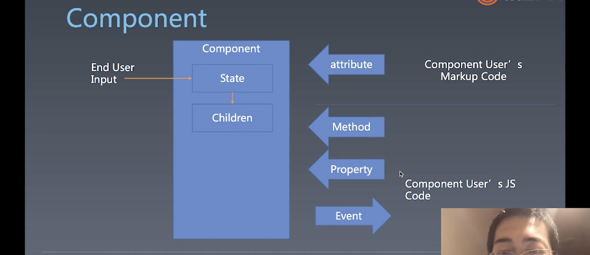

# 3.组件化 | 组件的基本知识，轮播组件

[toc]

## 组件的基础知识

组件化是接下来要讲的三大体系中的一个重点。

前端架构的问题 80% 是要解决组件化的问题，其他就是 UI 架构模式和一些零零碎碎的基础库的需求，这基本构成了前端架构的需求主体。

当然，如果我们要去做更多的，往底层去做，像 flutter 那样基于 webGL 去做就不太一样了。

我们前端主要做 UI，UI 里面基本上都是靠组建堆积出来的。 

### 对象和组件

> 其实从某个角度来讲，对象应该是一个抽象的概念，是帮助我们编程的一种理念——面向对象——的一部分。而我们前端开发者平时所说的对象，实际上是指 `{}` 这样一种数据结构，并带有基于 `property` 的继承能力。

对象中会有三种特性或机制：

- Properties 属性
- Methods 方法
- Inherit 继承

而组件在此基础上多了如下特性或机制：

- Attribute 
- Config(组件构造时的设置) & State(组件内部的状态)
- Event
- Lifecycle
- Children（由于组件一般是用组件树来进行描述，所以会有 Children 机制）

### 组件

可以使用这张图来理解组件，它阐明了组件的各个部分的作用。

组件的内部：

- State
  - 状态只会受到一种来源的改变，终端用户的输入，比如当前的 Tab，是用户所点击的那个。一般是不会受到外部的影响的。
- Children

剩下的 `Attribute` `Method` `Property` `Event` 都是组件的使用者和组件的作者之间交互的一种方式。可以理解为组件外部的参数。

- Attribute
  - 是像 JSX、HTML 这样的标记语言中所添加给元素的特性。
  - 一般的所接受的值只允许字符串，React 的 JSX 中是可以传入非字符串值的。
  - React 的 Attribute 和 Property 是完全互通的，这是一种设计方式。
- Method
  - Method 和 Property 是任何一个对象都会有的东西，组件一般我们使用对象去进行抽象。
  - 之后我们会讲到 Hooks，Vue 叫 composition API，使用这种特性的时候，跟组件的交互方式就会和之前不同。
- Property
- Event
  - component 是通过事件来将内部的状态传出去，和之前其他特性的数据流向不同。

### Attribute

#### Attribute vs Property

`Attribute` 和 `Property` 在中文中我们都会翻译为「属性」，但是在他们同时出现时，会将 `Attribute` 翻译为「特性」或特征值。

